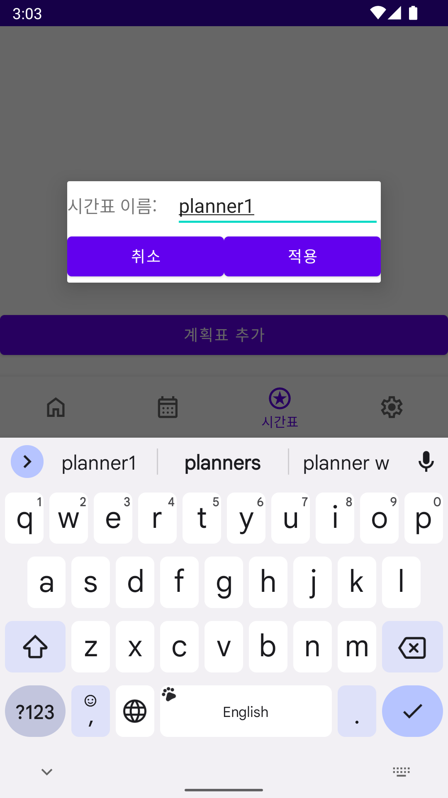
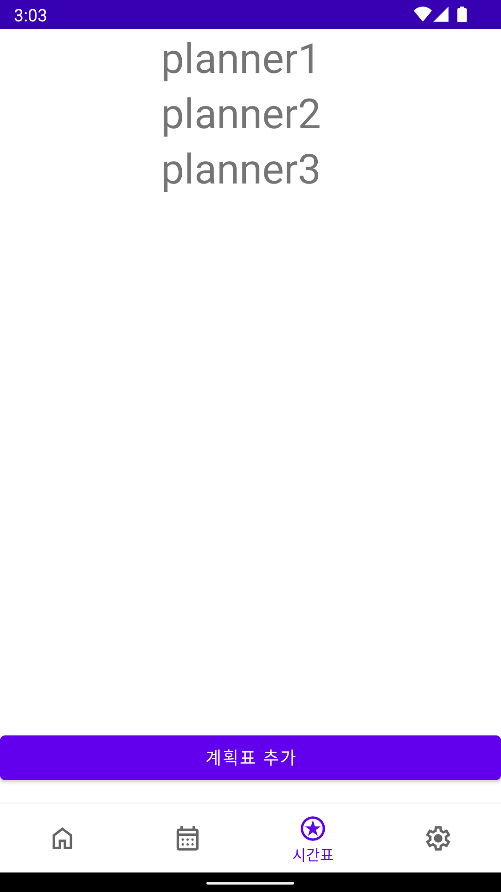
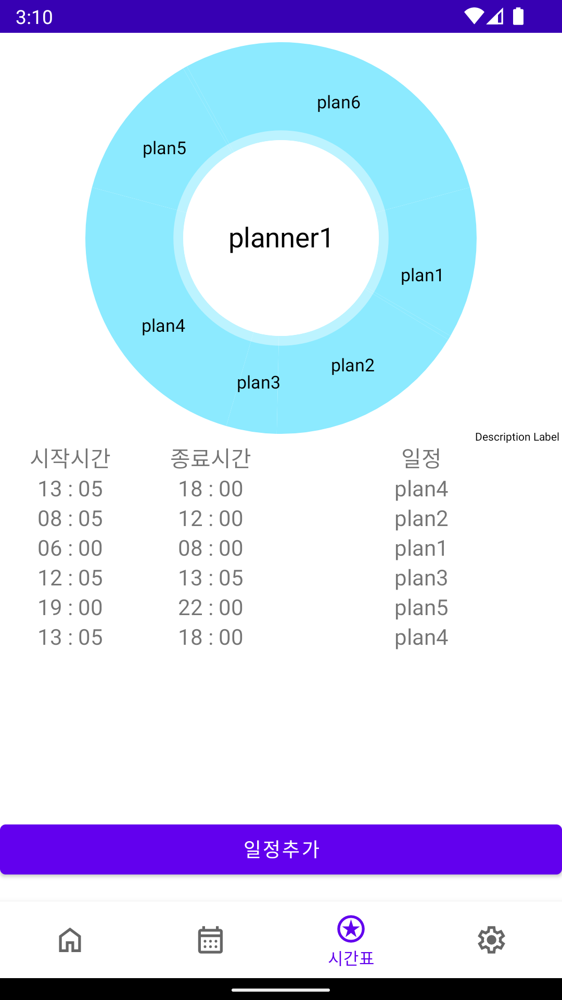
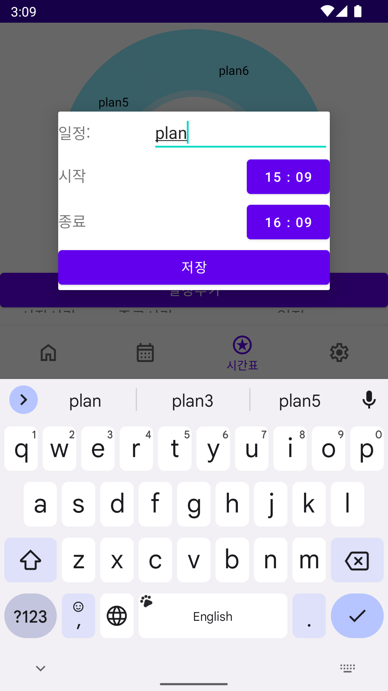
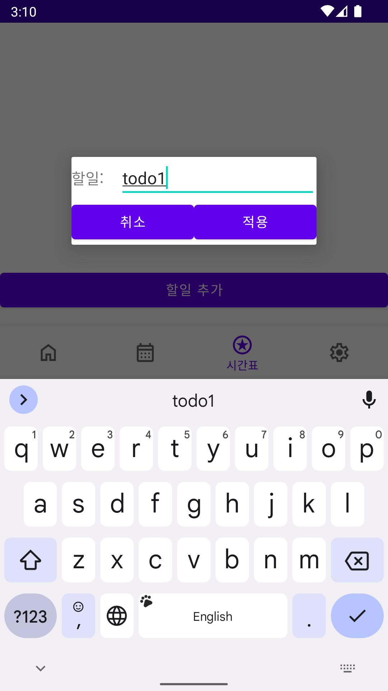
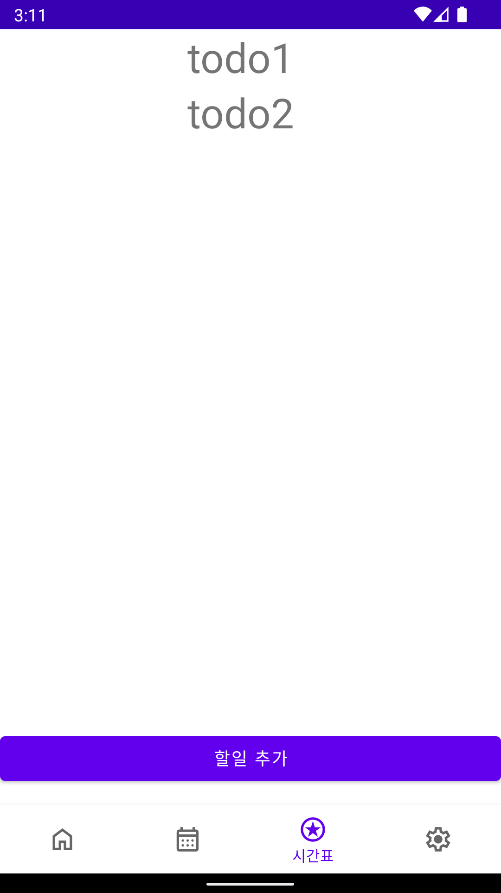
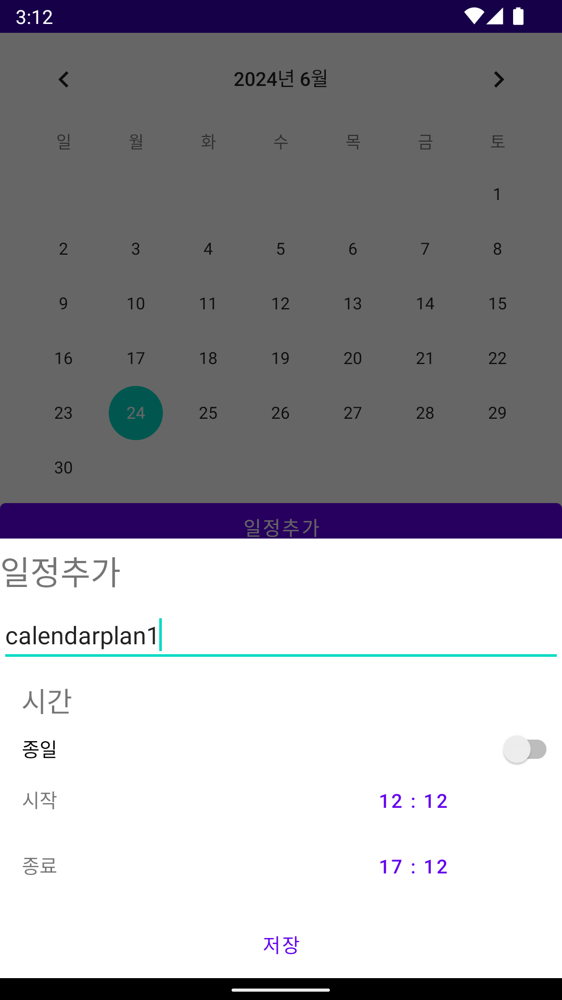
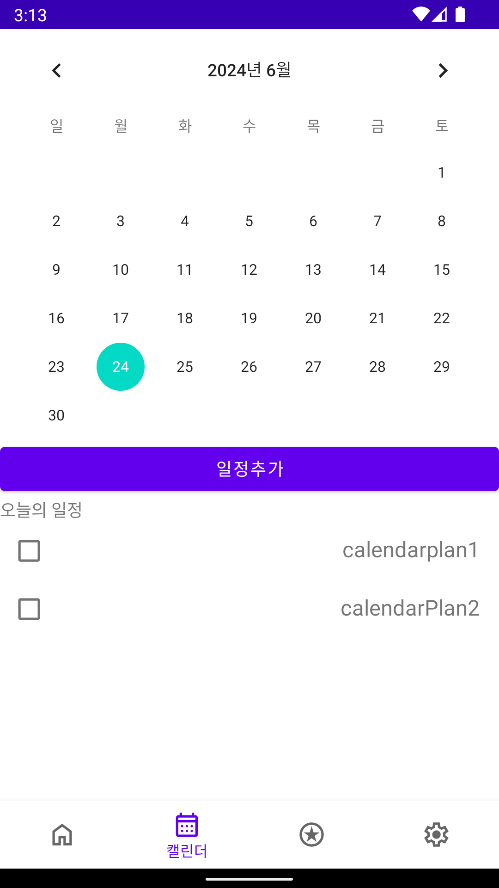
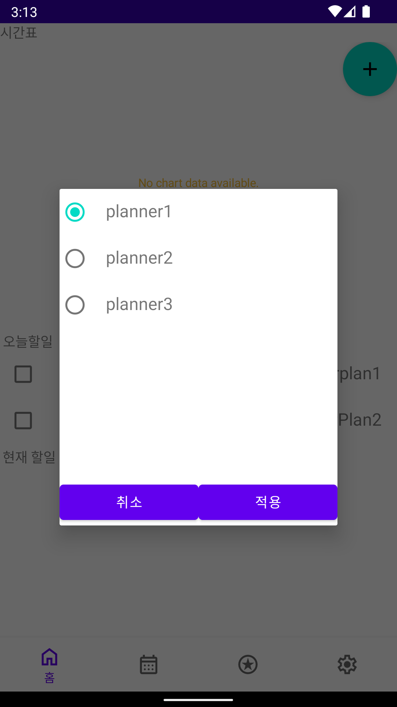
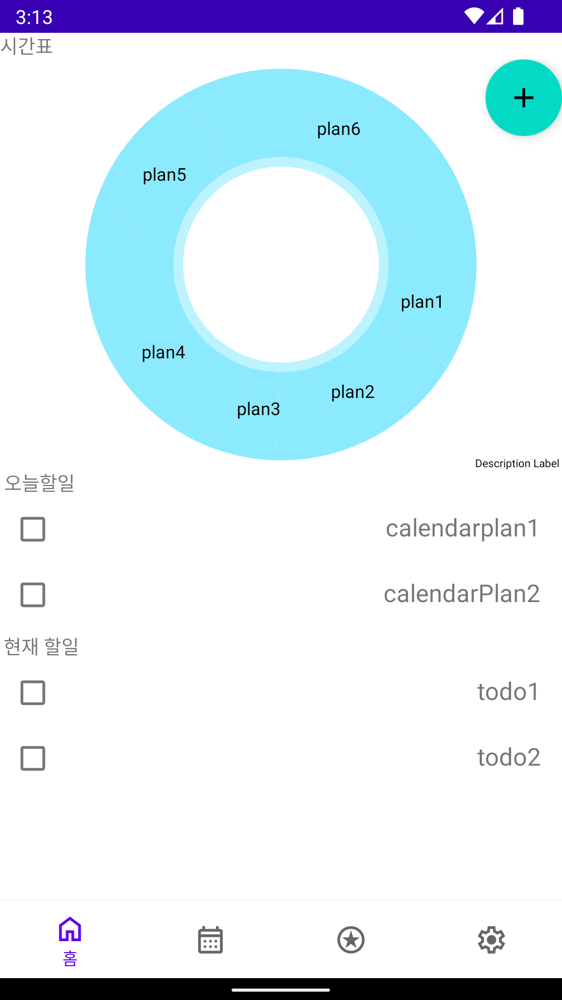

## ScheduleManager

---
캘린더와 계획표를 통합적으로 관리할 수있는 통합일정관리어플리케이션

### 실행화면

  <table>
    <tr>
        <td colspan ='2' align="center">시간표 추가</td>
    <tr>
      <td></td>
      <td></td>
    </tr>
  </table>

  <table>
    <tr>
        <td colspan ='2' align="center">일정추가</td>
    <tr>
      <td></td>
      <td></td>
    </tr>
  </table>

  <table>
    <tr>
        <td colspan ='2' align="center">일정의 세부 TodoList 추가</td>
    <tr>
      <td></td>
      <td></td>
    </tr>
  </table>

  <table>
    <tr>
        <td colspan ='2' align="center">캘린더에서 일정등록</td>
    <tr>
      <td></td>
      <td></td>
    </tr>
  </table>

  <table>
    <tr>
        <td colspan ='2' align="center">홈화면에서 전체적인 일정 관리</td>
    <tr>
      <td></td>
      <td></td>
    </tr>
  </table>

### 사용기술
- Kotlin
- Android

### 사용 라이브러리
- MPAndroidChart 
- Room

### TODO
- 업데이트(설정뷰, 실행시 기본설정 플래너 등등)