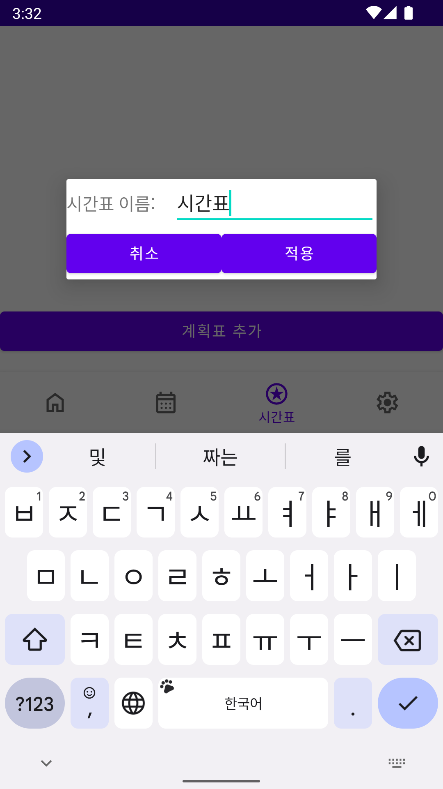
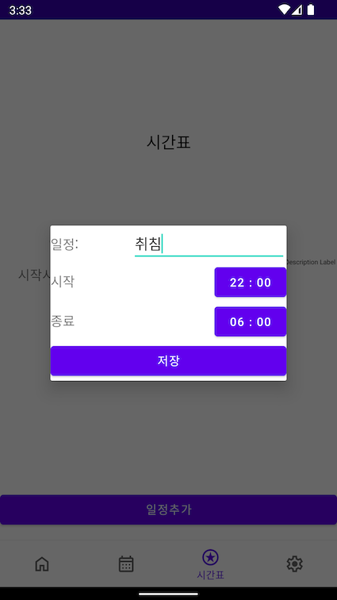
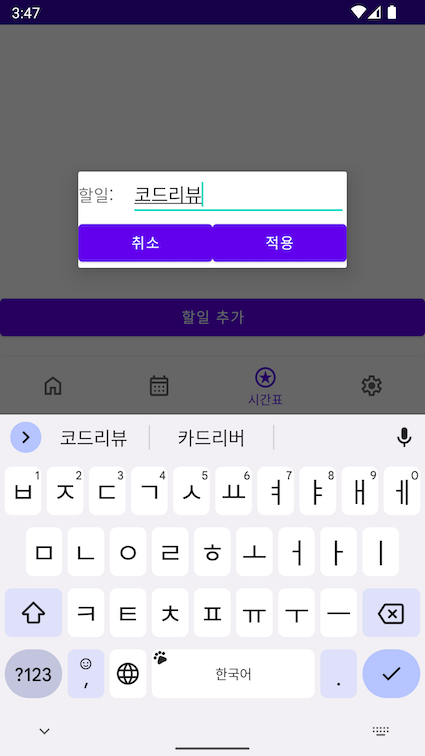
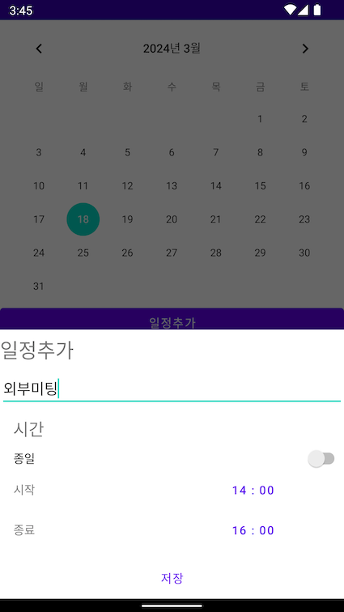
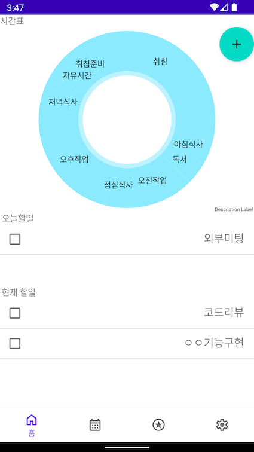

## ScheduleManager

---
캘린더와 계획표를 통합적으로 관리할 수있는 통합일정관리어플리케이션

### 실행화면
시간표 추가

일정추가

일정의 세부 TodoList 추가 가능

캘린더에서 일정등록 가능

홈화면에서 전체적인 일정 관리

### 사용기술
- Kotlin
- Android

### 사용 라이브러리
- MPAndroidChart 
- Room 

### TODO
- 리펙토링